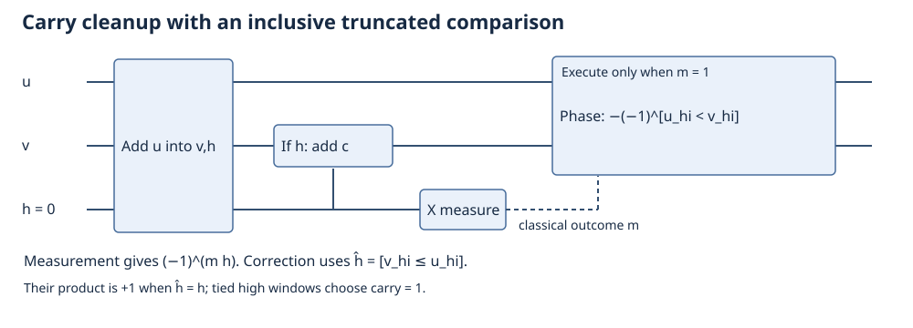
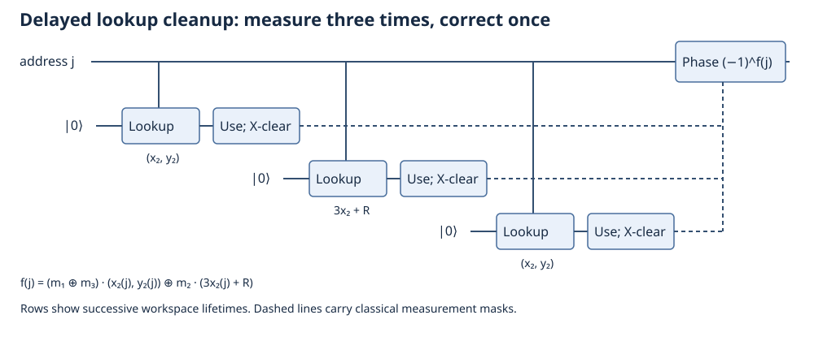

# Schrottenloher → IonQ-style circuits: executable reconstruction, revision 2

**The current construction costs 39,891,572 expected Toffolis, including explicit lookup cleanup.** Applying the same lookup counting convention to the original circuit gives **57,867,796**, a saving of **17,976,224 (31.06%)** over 28 point additions.

This starts from the actual [Schrottenloher repository](https://gitlab.inria.fr/capsule/qarton-projects/ec-point-addition/-/tree/a9538b3), commit `a9538b3872651af58f99563b7402c50a005af0ce`, with its Qarton dependency pinned to `4fdcf6961ad45104a460e5f54d587a6776a73461`. The upstream source is preserved. New circuits are in `ionq_reconstruction/` and are not replaced by expected classical answers during simulation.

Sources: [Schrottenloher paper](https://arxiv.org/html/2606.02235v1), [IonQ report, especially Sections V–VII and Algorithm 6](https://arxiv.org/html/2609.05625v1). This is an independent logical-circuit reconstruction, not IonQ's released implementation or a hardware compilation.

The first reconstruction is preserved in [RECONSTRUCTION-v1.md](RECONSTRUCTION-v1.md) and [commit 0585008](https://github.com/zsxqblz/ionq-ecdlp/tree/0585008ea7f7f9421a8c60565e06d4cf15f0072e/reconstruction/schrottenloher-ionq). Revision 2 removes its extra division flags, implements delayed lookup cleanup, and diagnoses its adversarial failures.

## 1. Disjoint cost ledger

| Module per point addition | Schrottenloher baseline | New expected Toffolis | Saving per addition | Saving over 28 |
|---|---:|---:|---:|---:|
| GCD record construction and erasure, four traversals | 850,276 | 616,460 | 233,816 | 6,546,848 |
| Replay for division and multiplication | 791,700 | 548,752 | 242,948 | 6,802,544 |
| Modular square subtraction | 207,964 | 58,605 | 149,359 | 4,182,052 |
| Remaining coordinate arithmetic | 15,581 | 2,752 | 12,829 | 359,212 |
| Three lookups and cleanup | 201,186 | 198,130 | 3,056 | 85,568 |
| **Total** | **2,066,707** | **1,424,699** | **642,008** | **17,976,224** |
| **28 additions** | **57,867,796** | **39,891,572** | | |

The first four rows come from the constructed circuit tree. The lookup row uses the exact 16-bit address-decoder and one-bit cleanup circuits, with payload-width independence justified below. The full composition is simulated with eight entries, not all 65,536 elliptic-curve points.

Counts use the baseline convention: a temporary AND costs one Toffoli, while its measurement-based uncompute is free. Static counts charge all explicitly conditional phase-comparison blocks; expected counts charge each such block half its cost because it is selected by a fresh uniform X-measurement outcome. Lookup phase correction runs unconditionally and is charged in full. Nested class counts in the JSON overlap; use the disjoint ledger rather than summing all parents and children.

| Accounting boundary | Baseline | Revision 1 | Revision 2 |
|---|---:|---:|---:|
| Common `3·2^16` lookup allowance, expected | 57,739,612 | 39,902,548 | **39,848,956** |
| Explicit separate baseline / merged new cleanup, expected | 57,867,796 | Not constructed | **39,891,572** |
| Explicit cleanup, static new count | | | **40,258,484** |

Thus the arithmetic improvement over revision 1 is **53,592 expected Toffolis**. Changing the lookup accounting boundary adds 42,616 relative to the old common allowance, so the more complete headline changes only slightly. The common-allowance estimate remains about **0.856 million above** the report's roughly 39.0-million estimate; the comparison target 38,993,024 itself is derived from its rounded 1.196-million arithmetic budget per addition.

None of these numbers is the report's 40,420,330 hardware-compiled injection count. Routing, ISA lowering, error correction, distillation, and Fourier/classical recovery are not reconstructed here.

## 2. What the circuit computes

The field is `p=2^256-c`, where `c=2^32+977`. An incoming affine point A=(x1,y1) and a coherent address j select a classical table point Tj=(x2,y2). The address remains unchanged.

| Operation | x register afterwards | y register afterwards |
|---|---|---|
| Subtract table coordinates | d=x1−x2 | y1−y2 |
| In-place division | d | λ=(y1−y2)/d |
| Add middle table entry | d+3x2+R | λ |
| Subtract square, then remove R | x2−x3 | λ |
| In-place multiplication | x2−x3 | λ(x2−x3) |
| Subtract final table coordinates | −x3 | y3 |
| Negate x | x3 | y3 |

All expressions are modulo p. R is a classical mask sampled before building the circuit and folded into the middle table. Infinity and the exceptional affine inputs A=Tj, A=−Tj, A=−2Tj are excluded. This is not a complete exceptional-case group law.

The important multiplication circuit is `record(x) → replay(record,y) → unrecord(x)`. Recording consumes the x register into a reversible history; unrecording restores x and clears the history. Division uses the opposite modular replay direction. A point addition needs two such sandwiches, hence four record traversals.

## 3. GCD record: signed arithmetic instead of controlled arithmetic

The reconstruction maintains odd positive registers with u≤v. In each round:

\[
a=u[1]\oplus v[1],\qquad v'=(v+(1-2a)u)/2,
\qquad m=a\land[u>v'],
\]

then swap u and v' under m. Here `[1]` denotes the second least significant bit; a selects the sign and m selects the orientation.

Let J(z)=2^N−1−z on an N-bit target. Since `J(J(z)+u)=z−u mod 2^N`, conditional target complements around an ordinary adder implement a sign-selected addition. Those complements are CNOTs. The expensive carry circuit is consequently an ordinary adder, instead of a controlled adder. The comparator and conditional swap are still necessary and still counted.

| One record traversal | Baseline | New |
|---|---:|---:|
| Main integer additions/subtractions | 120,248 | 60,526 |
| Initial controlled preparation | 0 | 514 |
| Comparisons | 28,177 | 28,272 |
| Conditional swaps | 60,124 | 60,783 |
| History compression | 4,020 | 4,020 |
| **Total** | **212,569** | **154,115** |

We retain 402 rounds, the baseline's shrinking-width schedule, a 77-bit comparison cap, and its ternary compressor. The record uses 670 compressed bits plus an initial parity bit. The extra initial orientation and extra integer value bit are explicit reconstruction choices, with their costs included. Truncated comparisons and the finite iteration budget are approximate.

## 4. Replay: the largest second contribution

Each recorded GCD step is a linear transformation modulo p, built from signed addition, halving, and a swap. Let M be their product. Because p is zero in the field, the initialized pair is `(0,x)` or `(x,0)`; the terminal pair is `(1,1)`.

For multiplication, coherently copy y into a second zero register with CNOTs, producing `(y,y)`, and apply the inverse transformations in reverse order. After undoing the initial orientation, the pair is `(0,xy)`. For division, apply the forward transformations to the oriented `(0,y)`; the result is `(y/x,y/x)`, and a CNOT clears the duplicate. This is an actual reversible circuit, not a classical modular inverse inserted into the quantum computation.

This construction uses canonical coefficient residues and inverse GCD matrices. The report instead describes shifted coefficients `s̃=s−(1−a)r`. These are different layouts for related transformations; the remaining resource gap is not yet assigned to individual differences between them.

| One replay | Baseline | New expected |
|---|---:|---:|
| Modular signed/controlled additions, including early zero handling | 255,954 | 137,440 |
| Doubling or halving | 28,944 | 25,728 |
| Conditional swaps | 102,912 | 103,168 |
| Compressed-history access | 8,040 | 8,040 |
| **Total** | **395,850** | **274,376** |

There are 365 regular additions at 336 expected Toffolis and 37 special additions at 400: `365·336+37·400=137,440`. Each special addition includes two approximate zero/p representation swaps. Doubling/halving costs 64 per round rather than 72, using 32-bit padding.

Multiplication and division now have the same cost: **582,606 expected / 589,038 static Toffolis** each, including record compute and erase. The extra 1,512-Toffoli division flags from revision 1 are gone.

### Why the phase correction no longer needs flags

Adding into a 257-bit register produces carry h. Fold h into the low register by adding hc, then X-measure h. Measurement outcome m contributes `(-1)^(mh)`. It must be corrected using the surviving registers; merely clearing the measured bit leaves an input-dependent phase.

Let U and V be the top 32 bits of the source and the folded target. Revision 2 uses

\[
\widehat h=[V\le U],\qquad
(-1)^{m\widehat h}=(-1)^m(-1)^{m[U<V]}.
\]

The phase circuit therefore needs a 32-bit PhaseLT comparator and a classically controlled global sign. Its equality case is inclusive in both sign branches.



When subtracting into zero, complementing that zero produces the noncanonical value 2^256−1. After addition and folding, the target is u+c−1. Usually its high window equals u's, so carry must be reconstructed as one on a tie. Revision 1 used a strict comparison in subtraction and compensated by tracking zero-target flags through the history. The new tie choice handles this case directly. Rare high-window boundary crossings remain part of the approximation; this is not a proof of exact carry reconstruction for every residue.

Removing those flags saves 1,512 per division. Reducing the phase comparator from 33 to 32 bits saves another 201 expected Toffolis per replay. Total improvement: `28·(1512+2·201)=53,592`. It also removes **73 qubits** from the composed circuit.

## 5. Modular squaring

The baseline costs `165,632 + 20,910 + 20,910 + 512 = 207,964`: 256 controlled modular additions, 255 doublings, 255 inverse doublings, and control-AND overhead.

Write x=L+BH with B=2^128 and S=L+H. Then

\[
x^2=L^2+B(S^2-L^2-H^2)+B^2H^2,
\qquad B^2\equiv c\pmod p.
\]

Compute two 128-bit integer squares and one 129-bit square. The signed-add squarer costs `T(n)=n(n+3)/2−1` for n≥2. Combine them using sparse reduction with `c=2^32+2^10−2^6+2^4+1`, then erase the square registers.

| Squaring submodule | Expected Toffolis |
|---|---:|
| Two 128-bit squares, compute and erase | 33,532 |
| One 129-bit square, compute and erase | 17,026 |
| Two shifted 256-bit contributions | 2,262 |
| One negative shifted 258-bit contribution | 1,653 |
| Sparse-c reduction, including high correction compute/erase | 3,412 |
| Remaining full-width subtraction | 464 |
| Build and erase L+H | 256 |
| **Total** | **58,605** |

The high correction costs 524 each way and is already in the reduction row. Nine conditional 32-bit phase comparisons give static cost 58,749 versus expected 58,605. This module is unchanged from revision 1.

The five other coordinate subtractions, one addition, and negation cost `5·464+336+96=2,752`, also unchanged. The square's internal subtraction is counted separately within squaring.

## 6. Delayed lookup cleanup is now constructed

The three loads return `(x2,y2)`, `(3x2+R)`, and `(x2,y2)`. X-measure the data after each use, keeping classical masks m1, m2, m3. The total unwanted phase is the parity

\[
f(j)=(m_1\oplus m_3)\cdot (x_2(j),y_2(j))
\oplus m_2\cdot (3x_2(j)+R).
\]

Dots mean binary inner products; field values are encoded as bit strings. A single one-bit table phase `(-1)^f(j)` cancels all three measurement phases. The three masks may stay classical while the same quantum workspace is reused. This is coherent correction, not address postselection.



`MergedLookupPhaseFix` builds this Boolean table from the actual measurement results, uses SelectSwapFwd to load its bit, applies Z, and reverses the lookup. It is not replaced by a dummy function. The new path is selected by `IonQPointAdd(..., merged_lookup=True)`; the separate-cleanup path remains available for comparison.

The inherited unary decoder costs N−2 Toffolis for N=2^w entries. Its non-Clifford control tree does not depend on the payload width; table contents only select Clifford fanouts. We built decoders at w=3,4,8,12,16, including the actual 65,536-entry one-bit decoder. We did not materialize every Clifford gate of the full 512-bit payload table.

A one-bit cleanup with select-swap parameter λ costs `C(N,λ)=2N/λ+4λ−8` here. At N=65,536 and λ=256, C=1,528. Therefore:

| Lookup construction | Toffolis per addition |
|---|---:|
| Three forward loads | 3·65,534 = 196,602 |
| Three separate cleanups | 3·1,528 = 4,584 |
| One merged cleanup | 1,528 |
| **Separate total** | **201,186** |
| **Merged total** | **198,130** |

Merging saves 3,056 per addition, or **85,568 over 28**. This is a logical implementation of delayed phase correction, not IonQ's trapped-ion routing schedule.

## 7. Verification and the adversarial failures

The revision-1 suite remains archived. The revision-2 quick suite passes, and targeted checks of the changed code additionally pass:

| Revision-2 check | Cases |
|---|---:|
| Delayed lookup with fully decomposed quantum gates, actual measurements, and coherent states | 240 |
| Signed modular addition, including 200 zero-target cases without flags | 2,200 |
| Multiplication, including four-branch coherence | 25 |
| Division without flags, including four-branch coherence | 25 |
| Full point addition with delayed lookup, including four-branch coherence | 9 |

Total: **2,499 targeted passing checks**. Large arithmetic simulations expand all new modules but retain Qarton's fast simulation of known exact primitives. The small lookup tests decompose those primitives too, including the circuits dynamically chosen from measurement masks. All arithmetic checks compare support and amplitude/sign and require released workspace to be zero.

The earlier “six failures” were six observed measurement trajectories, not a complete classification of bad inputs. `audit_boundaries.py` now independently models every arithmetic step for the 14 adversarial inputs and compares against **896 circuit trajectories**. Its predicted values and possible signs agree in every case. This is successful diagnosis, not successful arithmetic on those inputs.

Three of those input cases have wrong values; five have a phase error when the carry measurement is one, with one case overlapping. They arise from:

- **Noncanonical reduction:** for example adding u=1 into v=0 first represents zero as p, then produces p+1 without a 2^256 carry. The approximate carry fold does not reduce this back to 1.
- **False-positive zero/p swaps:** checking only the top 32 transformed bits can mistake small nonzero values for zero. In particular, a post-swap can turn the correct value 2 into `2 XOR p`.
- **Truncated phase ties:** equal high windows can occur with either true carry. A tie convention can protect the structurally common zero-target case but cannot make all adversarial ties correct.

These are genuine limitations of the approximate construction. Random tests do not establish a uniform error bound or reproduce the report's million-sample confidence analysis. The code does not claim exact modular arithmetic on all basis states.

## 8. Qubits, remaining gap, and reproduction

The eight-entry composed circuit now uses **1,448 logical qubits**, down from 1,521. Adding thirteen address bits gives **1,461 for this arithmetic layout** with a 16-bit selector. This remains four above the report's 1,457 and is not a complete full-table hardware workspace compilation. One retained bit is the baseline affine-point infinity flag even though our valid inputs are finite.

Remaining work is to reproduce the report's shifted coefficient layout and persistent orientation precisely, isolate the remaining roughly 30,569 arithmetic Toffolis per addition, and match full payload compilation and hardware lowering. No savings are assigned to those unimplemented differences.

Run from this directory:

```bash
bash setup-reconstruction.sh
./run-reconstruction.sh ionq_reconstruction.counts_v2
./run-reconstruction.sh ionq_reconstruction.verify_v2
./run-reconstruction.sh ionq_reconstruction.audit_boundaries
./run-reconstruction.sh ionq_reconstruction.verify --quick
```

The original full suite remains available as `ionq_reconstruction.verify`. Its output file is overwritten on each run; the original long-run record is retained as `results/v1-verification.json`. Current detailed results are `results/v2-counts.json`, `results/v2-verification.json`, and `results/boundary-audit.json`. `draw_diagrams.py` reproduces the SVGs. Source hashes and dependency versions are recorded in the repository.

Original licensing and attribution are retained. New code uses the same AGPL-3.0 terms; see `LICENSE.md`.
